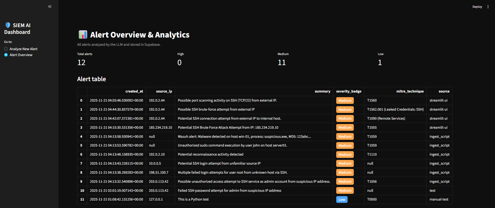
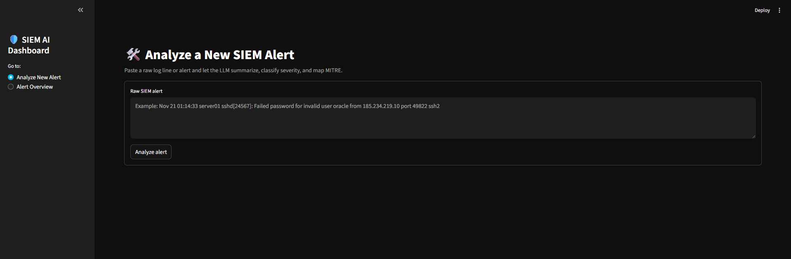
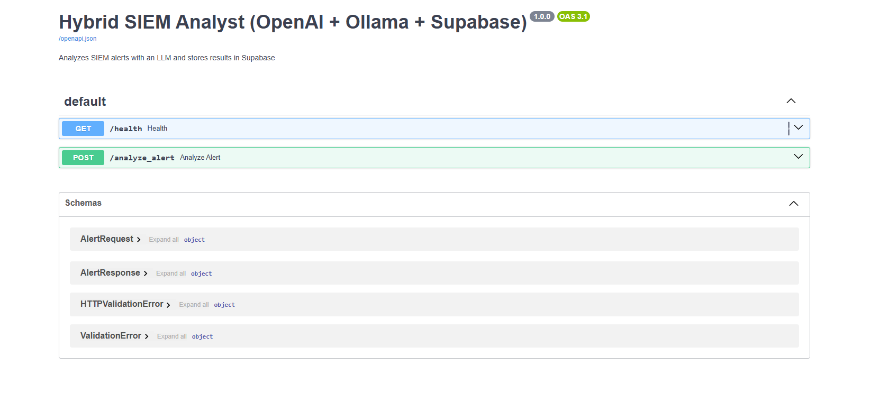
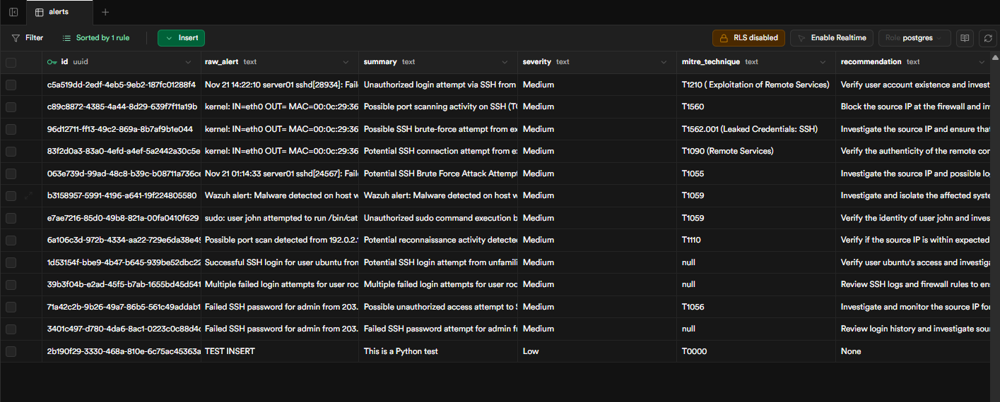
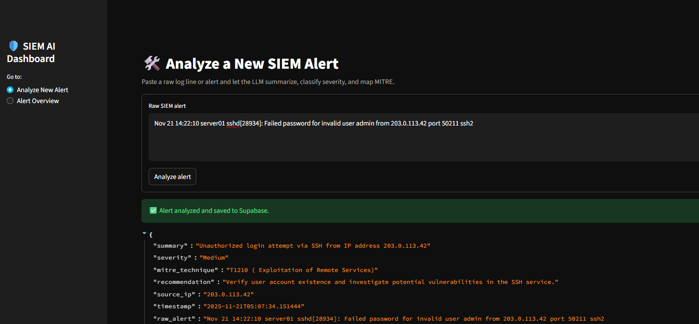

# LLM-Powered SIEM Alert Analyst  
A lightweight AI-driven system that analyzes raw SIEM alerts, summarizes them, assigns severity, maps MITRE ATT&CK techniques and stores everything in Supabase. This is built for SOC teams and startups that need fast and low cost alert triage.

---

## Overview

This repository showcases an AI-powered SIEM Analyst tool designed to automate Tier-1 SOC alert triage. The full production implementation is private. This public version includes:

- Architecture explanation  
- Safe example code snippets  
- Sample alerts and outputs  
- Screenshots of the working system  
- Explanation of SOC and startup value

---

## Features

- **FastAPI** – backend API for alert analysis  
- **OpenAI LLM** or optional Ollama local model – analysis, summarization, and MITRE mapping  
- **Supabase Postgres** – storing processed alerts  
- **Streamlit** – simple dashboard for visualization and alert review

---

## What the System Does

Given a raw SIEM alert, the system:

- Summarizes the event
- Assigns severity (Low, Medium, High)
- Maps to MITRE ATT&CK techniques
- Generates recommendations
- Extracts key details such as source IP  
- Stores results in Supabase
- Displays alerts in a Streamlit dashboard

Goal: Reduce alert fatigue and automate Tier-1 SOC analysis.

---

## System Architecture (Showcase Diagram)

        ┌────────────────┐
        │ Raw SIEM Alert │
        └───────┬────────┘
                │ POST /analyze_alert
                ▼
       ┌──────────────────────┐
       │       FastAPI        │
       │  (LLM Orchestrator)  │
       └───────┬──────────────┘
               │ Sends prompt
               ▼
       ┌──────────────────────┐
       │       LLM (AI)       │
       │ Summarize + MITRE    │
       └───────┬──────────────┘
               │
               ▼
       ┌──────────────────────┐
       │      Supabase        │
       │ stores classified    │
       │       alerts         │
       └───────┬──────────────┘
               │ Reads alerts
               ▼
       ┌──────────────────────┐
       │     Streamlit UI     │
       │ Analytics Dashboard  │
       └──────────────────────┘

## Key Code Snippets 

### FastAPI — Analyze Alert Endpoint

```python
@app.post("/analyze_alert")
def analyze_alert(request: AlertRequest):
    raw = request.raw_alert

    prompt = f"""
    You are a SOC analyst. Analyze the following log:
    {raw}
    Return a JSON object with:
    - summary
    - severity (Low, Medium, High)
    - mitre_technique (Txxxx)
    - recommendation
    - source_ip
    """

    result = client.chat.completions.create(
        model="gpt-4.1-mini",
        messages=[{"role": "user", "content": prompt}]
    )

    analysis = json.loads(result.choices[0].message["content"])
    supabase.table("alerts").insert(analysis).execute()

    return analysis
```

## Supabase Insert
```python
supabase.table("alerts").insert(analysis).execute()
```

## Example LLM Instruction
```text
You are a cybersecurity analyst. Classify severity, summarize, extract IPs, and map MITRE ATT&CK techniques.
```

## Dashboard & API Screenshots

### Streamlit Overview (Dashboard)

<p align="center">
  
</p>


### Streamlit Log Analyzer

<p align="center">
  
</p>

### FastAPI

<p align="center">
  
</p>


### Supabase Alerts Table

<p align="center">
  
</p>


### Example Raw → AI Output

<p align="center">
  
</p>


## Raw SIEM Log
```text
Nov 21 14:22:10 server01 sshd[28934]: Failed password for invalid user admin from 203.0.113.42 port 50211 ssh2
```

## LLM Output
```text
{
  "summary": "Unauthorized SSH login attempt from IP 203.0.113.42",
  "severity": "Medium",
  "mitre_technique": "T1110 (Brute Force)",
  "recommendation": "Review SSH logs and enforce strong authentication.",
  "source_ip": "203.0.113.42"
}
```

## Why This Matters
#### For SOC Teams
- Automates Tier-1 alert triage
- Reduces alert fatigue
- Standardizes severity scoring
- Maps alerts directly to MITRE ATT&CK
- Speeds analysis and investigation

#### For Startups
- No expensive SIEM needed
- Lightweight and deployable anywhere
- Enables SOC-grade insight with limited staffing
- Easy to integrate into existing pipelines


## Final Notes

- This repository is a showcase of my cybersecurity and AI work.
- The private version contains the complete working system, including ingestion tools, model orchestration, correlation logic and deployment workflows.
- If you would like to run the full version, integrate it into your stack, or collaborate, feel free to reach out.

## Contact
Abed Mashal
Email: abedmashal@gmail.com
LinkedIn: [insert link here](https://www.linkedin.com/in/abedmashal/)
